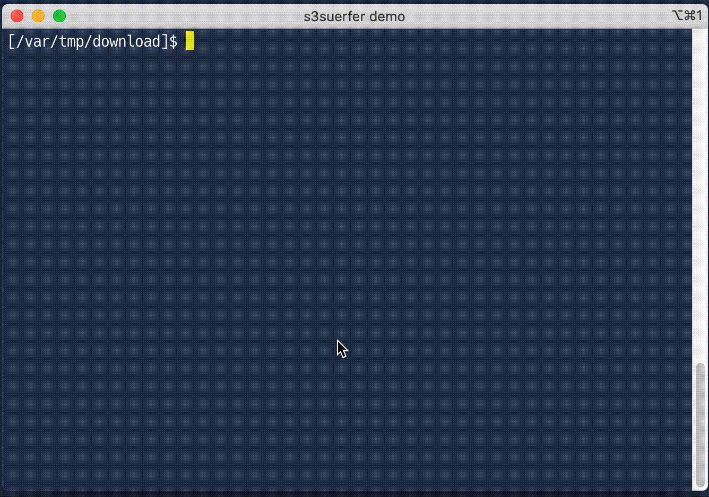

[](https://github.com/hirose31/s3surfer/actions/workflows/test.yml)
[](https://goreportcard.com/report/github.com/hirose31/s3surfer)
[](http://godoc.org/github.com/hirose31/s3surfer)

# s3surfer

`s3surfer` is CLI tool for browsing S3 bucket and download objects interactively.



# Installation

It's just a single binary file, **no external dependencies**.
Just download the appropriate version of [executable from latest release](https://github.com/hirose31/s3surfer/releases) for your OS.

# Usage

## Options

| Option | Description |
| --- | --- |
| `-b STRING` | S3 bucket name (optional) |
| `-d STRING` | Write debug log into file |
| `--version` | Print version information and exit |
| `-h` | Show help messages |

## Keyboard Commands

| Key | Description |
| --- | --- |
| `↓`, `j` | Select next item |
| `↑`, `k` | Select previous item |
| `Enter`, `l` | Move into directory |
| `u`, `h` | Move parent directory |
| `d` | Download the selected file or directory into the current working directory |
| `q` | Quit |

## Environmental Variables

| Variable | Description |
| --- | --- |
| `AWS_PROFILE` | Use a specific profile from your credential file. |

## Examples

Using default profile, specify bucket name.

```
$ s3surfer -b my-bucket
```

Using `my-profile` profile, choose bucket in `s3surfer`.

```
$ env AWS_PROFILE='my-profile' s3surfer
```

# Note

- Set ambiguous characters to single-width in your terminal setting.
- If the total download size is greater than 80% of the available size of the destination partition, the download will not start.
